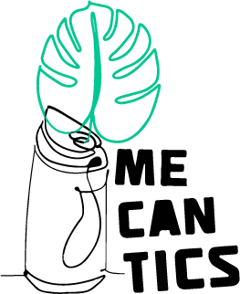
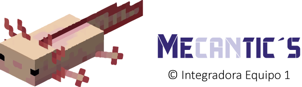

 
 

# MecanTic's - Integradora Equipo 1

MecanTic's es un proyecto académico, desarrollado y llevado a cabo por los alumnos de la carrera en Tecnologías de la Información (grupos T-301 y T-302), de la Universidad Tecnológica de los Valles Centrales de Oaxaca; el cual, sirvió como objeto de evaluación, para la materia Integradora 2022,  que tenía por objetivo poner en práctica los conocimientos de adquiridos por los alumnos durante su ya primer año de estudios universitarios. 

De forma bastante resumida, este proyecto buscaba impulsar la recolección de basura, específicamente latas de aluminio (conseguidas dentro y fuera de la institución); a través de una aplicación que, aunada a una máquina compactadora de latas (por medio de un enlace bluetooth), permitiera ir consiguiendo “puntos” a los estudiantes y al personal académico, por cada lata que compactaran. Dichos puntos, tenían la intención de ser utilizados en la cafetería y demás servicios de la escuela como moneda de cambio a fin de amenizar sus gastos dentro de la institución.

## Integrantes del Equipo

- Sánchez Romero Guadalupe 
- Antonio Lopez Ana Griselda
- Almaraz Perez Carlos Emmanuel
- Valencia García Víctor Gabriel

 
 

